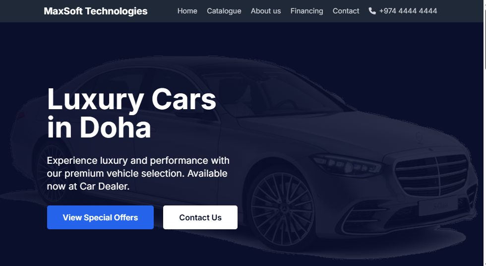
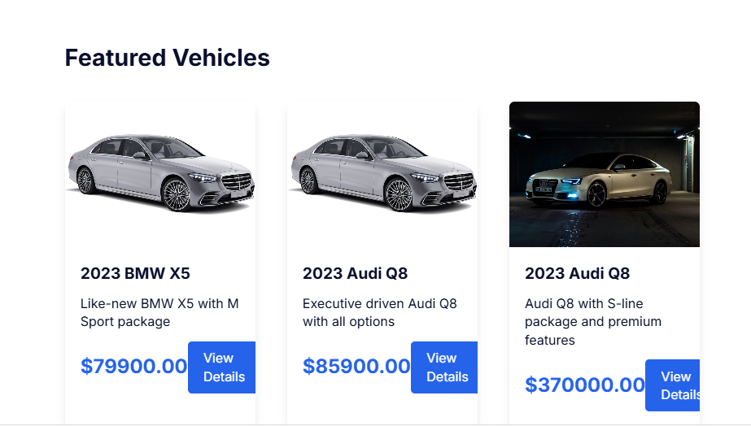
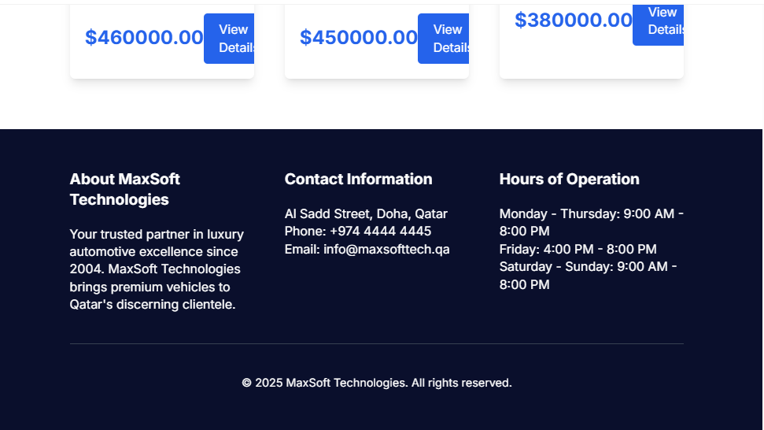
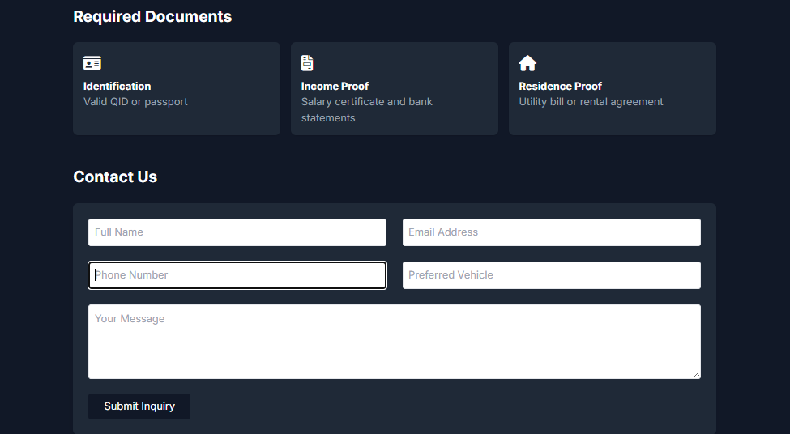
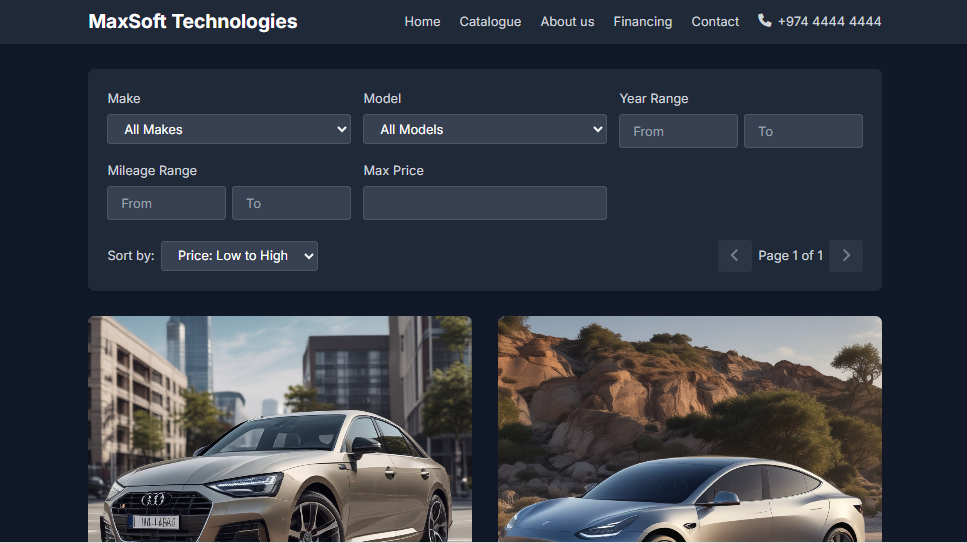

# **Car Dealership**

This application provides a comprehensive solution for managing car inventories, dealership information, reviews, and more.

## Overview

The project combines a Django-based backend with a modern frontend, offering functionality that includes:

- Inventory management and updates.
- Dealership location details.
- User reviews and ratings.
- Data analytics for informed decision making.

## Screenshots

Below is a screenshot of the application interface:

*Note: Replace the image path with your actual screenshot image location.*

## Getting Started

1. **Clone the repository:**  
   `git clone https://your-repository-url`

2. **Set up the backend:**  
   Navigate to the [djangoapp](djangoapp/) directory, install dependencies, configure your environment variables in `.env`, and run migrations.

3. **Set up the frontend:**  
   Navigate to the [frontend](frontend/) directory, install dependencies, and start the development server.

4. **Run the application:**  
   Ensure both backend and frontend are running to access the complete application.

## Technologies

- **Backend:** Django ([djangoapp/settings.py](djangoapp/settings.py))
- **Frontend:** JavaScript/TypeScript ([frontend/package.json](frontend/package.json))
- **Database:** SQLite ([db.sqlite3](db.sqlite3))
- **APIs:** Integration with RESTful services using Django's [restapis.py](djangoapp/restapis.py)

## License

This project is licensed under the MIT License.